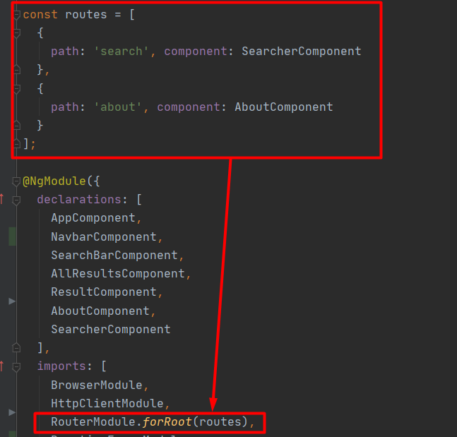

# Введення в концепції Angular
Angular це фреймворк від компанії Google для створення клієнтських додатків. Перш за все він націлений на розробку SPA-рішень (Single Page Application), тобто односторінкових додатків. В цьому плані Angular є спадкоємцем іншого фреймворка AngularJS. У той же час Angular це не нова версія AngularJS, а принципово новий фреймворк.

Angular надає таку функціональність, як двостороннє зв'язування, що дозволяє динамічно змінювати дані в одному місці інтерфейсу при зміні даних моделі в іншому, шаблони, маршрутизація і так далі.

Однією з ключових особливостей Angular є те, що він використовує в якості мови програмування TypeScript. Тому перед початком роботи рекомендується ознайомитися з основами цієї мови.

Але ми не обмежені мовою TypeScript. При бажанні можемо писати програми на Angular за допомогою таких мов як Dart або JavaScript. Однак TypeScript все таки є основною мовою для Angular.

Архітектура програми Angular спирається на певні фундаментальні концепції. Основними будівельними елементами фреймворку Angular є Angular components (компоненти), які організовані в NgModules . NgModules збирають відповідний код у функціональні набори; Програма на Angular визначається набором NgModules. Вона завжди має принаймні кореневий модуль, який дозволяє завантажувати, і, як правило, має набагато більше модулів функцій.

* Компоненти визначають подання (views), які являють собою набори елементів екрану, які Angular може обирати та модифікувати відповідно до вашої логіки програми та даних.
* Компоненти використовують служби (services), які надають певні функціональні можливості, не пов'язані безпосередньо з поданнями. Постачальників послуг можна вводити в компоненти як залежності , роблячи ваш код модульним, багаторазовим та ефективним.

Модулі, компоненти та служби - це класи, в яких використовуються декоратори. Ці декоратори позначають свій тип і надають метадані, які вказують Angular, як ними користуватися.

* Метадані класу компонентів пов'язують їх із шаблоном, який визначає подання. Шаблон поєднує звичайний HTML із Angular директивами (directives) та розміткою прив'язки (binding markup), які дозволяють Angular змінювати HTML перед тим, як генерувати його для відображенн.
* Метадані для класу служби надають інформацію, необхідну Angular, щоб зробити її доступною для компонентів за допомогою введення залежностей (dependency injection (DI)).

Компоненти програми зазвичай визначають безліч подань, розташованих ієрархічно. Angular надає Router service, яка допоможе вам визначити шляхи навігації серед подань. Маршрутизатор забезпечує складні навігаційні можливості в браузері.

# Початок роботи c Angular
Для роботи з Angular необхідно встановити сервер Node.js і пакетний менеджер npm, якщо вони відсутні на робочій машині. Для установки можна використовувати [програму установки Node.js.](https://nodejs.org/en/) Разом з сервером вона також встановить і npm. При цьому особливого якогось знання для роботи з NodeJS і npm не потрібно.

## Установка Typescript

Для установки Typescript відкриємо консоль/командний рядок і виконаємо в ній наступну команду: `npm install typescript --save-dev`

## Установка Angular CLI
Для компіляції додатка ми будемо використовувати інфраструктуру Angular CLI. Angular CLI спрощує створення додатка, його компіляцію. Angular CLI поширюється як пакет npm, тому для його використання його необхідно спочатку встановити. 

Для установки Angular CLI відкриємо консоль/командний рядок і виконаємо в ній наступну команду: `npm install -g @angular/cli`

Дана команда встановить пакет @angular/cli в якості глобального модуля, тому в подальшому при створенні новий проектів Angular його не буде потрібно встановлювати заново.

Ту ж команду можна використовувати для оновлення Angluar CLI при виході нової версії фреймворка. Перевірити версію CLI можна в командному рядку/консолі за допомогою команди: `ng version`

### Підключення Bootstrap
Bootstrap - це найпопулярніший фреймворк HTML і CSS для легкого створення макетів без глибоких знань CSS.
Підключення:

Спочатку перейдіть в каталог проекту і введіть команду: `npm install bootstrap`

Потім додайте рядок `"node_modules/bootstrap/dist/css/bootstrap.min.css"` до стилів ось так:


# Створення нового проекту: 
Angular CLI дозволяє легко створити проект командою: `ng new *Назва проекту*`. Команда запитує інформацію про функції, які потрібно включити в початковий проект програми. Прийміть значення за замовчуванням, натиснувши клавішу Enter або Return. Інтерфейс CLI Angular встановлює необхідні пакети Angular npm та інші залежності. Це може зайняти кілька хвилин.

## Запуск проекту
Перейдіть до каталогу робочої області та запустіть програму.
1. `cd *Назва проекту*` 
2. `ng serve --open `

Команда `ng serve` створює додаток, запускає сервер розробки, переглядає вихідні файли та відновлює додаток під час внесення змін до цих файлів.
Прапор --open відкриває браузер до http://localhost:4200/.

# Компоненти
Сторінка, яку ви бачите, - це оболонка програми. Оболонка управляється angular компонентою з назвою AppComponent.
Компоненти є фундаментальними будівельними блоками angular додатків. Вони відображають дані на екрані, відслідковують введені користувачем дані і виконують дії на основі цього вводу.

## Внесіть зміни до програми
Відкрийте проект у вашому улюбленому редакторі або IDE та перейдіть до папки src/app, щоб внести деякі зміни в початкову програму.
Ви знайдете реалізацію оболонки AppComponent, розподілену між трьома файлами:
* `app.component.ts` - код класу компоненти, написаний на TypeScript.
* `app.component.html` - шаблон компоненти, написаний у форматі HTML.
* `app.component.css` - приватні стилі CSS компоненти.

## Щоб створити нову компоненту за допомогою Angular CLI:

У вікні терміналу перейдіть до каталогу, що містить вашу програму.
Запустіть команду `ng generate component <component-name>`, де `<component-name>` - ім'я вашого нового компонента.
За замовчуванням ця команда створює таке:

* Папка, названа як і компонента
* Файл компонента, `<component-name> .component.ts`
* Файл шаблону, `<component-name> .component.html`
* Файл CSS, `<component-name> .component.css`
* Файл специфікації тестування, `<component-name> .component.spec.ts`


# Модулі

Додатки Angular модульні, і Angular має власну систему модульності, яка називається NgModules. NgModules - це контейнери для цілісного блоку коду, присвяченого домену програми, робочому процесу (workflow) або тісно пов'язаному набору можливостей. Вони можуть містити компоненти, провайдерів послуг та інші файли коду, поле дії яких визначається вмістом NgModule. Вони можуть імпортувати функціонал, який експортується з інших NgModules, та експортувати вибрану функціональність для використання іншими NgModules.

Кожна програма Angular має принаймні один клас NgModule, кореневий модуль, який називається умовно AppModule і знаходиться у файлі з іменем `app.module.ts`. Ви запускаєте програму, завантажуючи корінь NgModule.

Незважаючи на те, що невелика програма може мати лише один NgModule, більшість програм мають набагато більше модулів функцій. Кореневий NgModule для програми названий так, оскільки він може включати дочірні NgModules в ієрархію будь-якої глибини.

## Метадані NgModule
NgModule визначається класом, задекорований @NgModule(). Декоратор @NgModule() - це функція, яка приймає один об'єкт метаданих, властивості якого описують модуль. Найважливіші властивості такі:
* declarations: Компоненти, директиви та канали, що належать до цього NgModule.
* exports: Підмножина оголошень, яка повинна бути видимою та придатною для використання в шаблонах компонентів інших модулів NgModules.
* imports: Інші модулі, експортовані класи яких потрібні шаблонам компонентів, ог*олошеним у цьому NgModule.
* providers: Творці послуг, які цей NgModule сприяє глобальному збору послуг; вони стають доступними у всіх частинах програми. (Ви також можете вказати постачальників на рівні компонентів.)
* bootstrap: основний вигляд програми, який називається кореневим компонентом, в якому розміщені всі інші представлення програм. Тільки кореневий NgModule повинен встановлювати властивість bootstrap

Ось просте визначення кореневого NgModule:

```typescript
import { NgModule } from '@angular/core';
import { BrowserModule } from '@angular/platform-browser';

@NgModule({
  imports:      [ BrowserModule ],
  providers:    [],
  declarations: [ AppComponent ],
  exports:      [ AppComponent ],
  bootstrap:    [ AppComponent ]
})
export class AppModule { }
```
# Сервіси та впровадження залежностей 
Сервіси - це широка категорія, що охоплює будь-яке значення, функцію чи функцію, які потрібні додатку. Сервіс - це, як правило, клас із вузьким, чітко визначеним призначенням. Він повинен робити щось конкретне і робити це добре.

Angular відрізняє компоненти від сервісів для збільшення модульності та повторного використання. Виділяючи функціональність, пов’язану з переглядом компонента, від інших видів обробки, ви можете зробити класи своїх компонентів стрункими та ефективними.

В ідеалі завдання компонента полягає в тому, щоб забезпечити взаємодію з користувачем і не більше того. Компонент повинен представляти властивості та методи прив'язки даних, щоб бути посередником між поданням (відтвореним шаблоном) та логікою програми (яка часто включає певне поняття моделі).

Компонент може делегувати певні завдання службам, наприклад, отримувати дані з сервера, перевіряти введені користувачем дані або реєструватися безпосередньо на консолі. Визначаючи такі завдання обробки в ін’єкційному класі обслуговування, ви робите ці завдання доступними для будь-якого компонента. Ви також можете зробити свій додаток більш пристосованим, вводячи різних постачальників одного і того ж сервісу, залежно від ситуації.

Angular не забезпечує виконання цих принципів. Angular допомагає вам слідувати цим принципам, полегшуючи врахування логіки вашого додатка до служб і надання цих послуг доступним для компонентів за допомогою введення залежностей.

 Щоб згенерувати новий сервіс потрібно використати команду:
 
 `ng generate service <service-name>`, де `<service-name>` - ім'я вашого нового сервісу.
Приклад сервісу (WikiService):

```typescript
import {Injectable} from '@angular/core';
import {HttpClient} from '@angular/common/http';
import {Observable} from 'rxjs';
import {Result} from '../models/result';

@Injectable({
  providedIn: 'root'
})
export class WikiService {

  constructor(private httpClient: HttpClient) {
  }

  search(definition: string): Observable<any>{
    return this
      .httpClient
      .get<Result[]>('https://en.wikipedia.org/w/api.php', {
      params: {
        action: 'query',
        list: 'search',
        srsearch: definition,
        format: 'json',
        origin: '*'
      }
    });
  }
}
```
## Введення залежності (Dependency Injection DI)
DI вбудований в структуру Angular і використовується всюди для надання нових компонентів з послугами або іншими необхідними речами. Компоненти споживають послуги; тобто ви можете впровадити службу в компонент, надавши компоненту доступ до цього класу служби.

Щоб визначити клас як службу в Angular, використовуйте декоратор `@Injectable()`, щоб надати метадані, які дозволяють Angular впроваджувати його в компонент як залежності. Точно так же використовуйте декоратор `@Injectable()`, щоб вказати, що компонент або інший клас (наприклад, інша служба, канал або NgModule) має залежність.

* Injector - це основний механізм. Angular створює для вас інжектор для всього програми під час процесу початкового завантаження і додаткові інжектори в міру необхідності. Форсунки створювати не потрібно.

* Injector створює залежності і підтримує контейнер залежностей, які він повторно використовує, якщо це можливо.

* Provider  - це об'єкт, який повідомляє інжектору, як отримати або створити залежність.

Для будь-якої залежності, яка вам потрібна в вашому додатку, ви повинні зареєструвати постачальника за допомогою інжектора додатки, щоб інжектор міг використовувати постачальника для створення нових екземплярів.

Приблизно так виглядає процес впровадження WikiService:


# Починаємо розробку сайту, для пошуку по Вікіпедії
Створюємо новий проект і формуємо його структуру:


## Отримання даних з Вікіпедії
Для цього нам неохідно сформувати запит до API Вікіпедії. Для цього використаємо програму Postman:


### Cтворення моделі даних
Створимо інтерфейс для здійснення перевірки типу та зберігаємо його в папці models. Поля інтерфейсу повинні відповідати назвам ключів які прийшли по запиту на API Вікіпедії:

```typescript
export interface Result {
  title: string;
  wordcount: number;
  snippet: string;
  pageid: number;
}
```
### Створення сервісу, який буде робити запит
Створюємо сервіс під назвою `wiki` командою `ng generate service wiki` або, якщо ви користуєтесь IDE від JetBrains можна зробити так:


Далі обираємо те, що хочемо згенерувати, в нашому випадку сервіс(service)


Більшості інтерфейсних програм потрібно взаємодіяти з сервером за протоколом HTTP, щоб завантажувати або завантажувати дані та отримувати доступ до інших сервісних сервісів. Angular надає спрощений клієнтський HTTP API для програм Angular - HttpClient.
Але перш ніж використовувати HttpClient, потрібно імпортувати Angular HttpClientModule. Робиться це в корені (файлі app.module.ts):


Далі ми вже можемо впровадити HttpClient в наш сервіс і використати його метод `get` у якому вказуємо посилання та параметри запиту: дія, формат отримання, ключеве слово по якому робиться пошук та тип отримання.

```typescript
import {Injectable} from '@angular/core';
import {HttpClient} from '@angular/common/http';
import {Observable} from 'rxjs';
import {Result} from '../models/result';

@Injectable({
  providedIn: 'root'
})
export class WikiService {

  constructor(private httpClient: HttpClient) {
  }

  search(definition: string): Observable<any>{
    return this
      .httpClient
      .get<Result[]>('https://en.wikipedia.org/w/api.php', {
      params: {
        action: 'query',
        list: 'search',
        srsearch: definition,
        format: 'json',
        origin: '*'
      }
    });
  }
}
```

## Створення всіх необхідних компонентів 
### NavBar
Створюємо нову компоненту *NavBar*.

Тут ми реалізуємо маршрутизацію нашого сайту. Він буде містити 2 сторінки:
* Searcher
* About

Зобразимо схематично:


Створимо для цього окремі компоненти:

1. Створюємо нову компоненту *About*. Додаємо мінімальну структуру:

```html
<div class="text-center p-xl-5">
  <h1 class="display-4 ">About us page</h1>
  <p class="lead text-muted mb-0">Minimal about us page</p>
</div>
```
2. Створюємо нову компоненту *Seacher*.

Для реалізації переходу між сторінками нам потрібно імпортувати `RouterModule` та прописати для нього шляхи (routes):
(path - шлях при якому буде відображено вказану компоненту)



Далі переходимо в компоненту NavBar та застосовуємо до елемента в шаблоні (`navbar.component.html`) роблячи елемент посиланням, який ініціює навігацію до маршруту. Навігація відкриває один або кілька маршрутизованих компонентів в одному або декількох місцях на сторінці:

```html
<nav class="navbar navbar-expand-sm navbar-dark bg-dark header_fixed">
    <h1 class="navbar-brand padd">{{title}}</h1>
    <div class="collapse navbar-collapse " id="navbarNav">
      <ul class="navbar-nav">
        <li class="nav-item ">
          <a class="nav-link" [routerLink]="['search']">Searcher</a> 
        </li>
        <li class="nav-item">
          <a class="nav-link" [routerLink]="['about']">About</a>
        </li>
      </ul>
    </div>
</nav>
```
Тепер залишилося відобразити компоненту *NavBar* та застосувати спеціальний заповнювач, за допомогою якого Angular динамічно вставляє потрібу компоненту на основі поточного стану маршрутизатора.
Для цього переходимо в `app.component.html` і прописуємо:

 ```typescript
 <app-navbar></app-navbar>
<router-outlet></router-outlet>
```
Маршрутизація готова!

#### Searcher
Тепер, нарешті переходимо до пошуку та відображення результатів пошуку
Створимо три нові компоненти: *Seach-Bar*, *All-Results*, *Result*


Далі зобразимо схематично логіку їх взаємодії:


Далі зобразимо макет сторінки, який нам потрібно реалізувати:


#### Seach-Bar
Тут ми отримаємо дані від користувача та передамо їх до батьківської компоненти.
Щоб отримати дані від користувача використаємо `Angular Reactive Forms`. Для цього нам потрібно імпортувати `ReactiveFormsModule` в наш кореневий модуль.

Далі у коді компоненти використаємо конструктор `FormControl`. Створюючи цей елементи управління в своєму класі компонентів, ви отримуєте негайний доступ для прослуховування, поновлення і перевірки стану введення форми. Потім щоб додати групу форм до цього компонента, виконуємо такі дії: 
1. Створіть екземпляр `FormGroup`.
2. Пов’яжіть `FormGroup` модель і `FormControl`.

Потім, додаємо метод, який буде реагувати на відправку форми  

  ```typescript
  definition = new FormControl();

  contactForm = new FormGroup({
    name: this.definition
    
  contactFormSubmit(): void {
    if (this.contactForm.value.name === null) {
      alert('Wrong input!');
      return;
    }

    this.options = this.getDataFromLocalStorage();
    const formDefinition = this.contactForm.value.name;
  });
  ```

Далі прописуємо макет форми.
Атрибути форми 
1. `formGroup="contactForm"`, для прив'язки об'єкта contactForm до конкретного елементу форми
2. `ngSubmit="contactFormSubmit"`, відстежує подію, яку можна пов'язати з функцією зворотного виклику (contactFormSubmit)

Атрибути поля для введення
1. `formControl="definition"` для прив'язки об'єкта definition до конкретного елементу formControl

Отже, маємо:
```html
<div class="navbar navbar-light pad">
  <form class="form-check-inline" [formGroup]="contactForm" (ngSubmit)="contactFormSubmit()">
    <div class="d-lg-inline-flex">
      <input class="form-control mr-sm-2" [formControl]="definition">
    </div>
    <button class="btn btn-success pad">Search</button>
  </form>
</div>
```
Дані від користувача отримали!

Тепер потрібно відправити на батьківський компонент (*Searcher*)

Для цього створимо властивість definitionEmitter і використаємо декоратор  `@Output()`
  ```typescript
  @Output()
  definitionEmitter = new EventEmitter();
  ```
  * `@Output()` — функція-декоратор, що позначає властивість як спосіб переходу даних від дитини до батьків
  * `EventEmitter()` - повідомляє Angular про створення нового (випромінювача) подій 

Далі додамо у функцію contactFormSubmit, this.definitionEmitter.emit(formDefinition), щоб при відправці форми `EventEmitter` наповнив `definitionEmitter` значенням, яке прийшло з форми.

Налаштуємо батьківську компоненту (*Searcher*):
У коді компоненти створимо метод, який буде приймати дані з дочірньої компоненти:
```typescript
  getResultsByDefinition(definition: string): void {}
```
Встановимо селектор дитини, в шаблоні батьківського компонента
```typescript
<app-search-bar (definitionEmitter)="getResultsByDefinition($event)"></app-search-bar>
```

Подія зв'язування `(definitionEmitter)='getResultsByDefinition($event)'`, пов'язує подію в дитині, definitionEmitter до методу в батьківському, `getResultsByDefinition()`. `$event` містить дані , які користувач вводить в `<input>` в дочірній шаблон для користувача інтерфейсу.

Дані з дочірньої в батьківську компоненту передано!

#### Searcher
Тут ми повинні використати уже створений нами сервіс пошуку по Вікіпедії (`wiki.service`)  для отримання результатів пошуку. Самі ж результати пошуку передамо далі (в компоненту *All-Results*)

Щоб це реалізувати впроваджуємо цей сервіс в нашу компоненту:
```typescript
  constructor(private wikiService: WikiService) { }
```
Створимо нову властивість (поле) `results = []` - пустий масив, у який ми будемо записувати результати пошуку.
Далі в уже створеному методі, який приймає дані з дочірньої компоненти, викликаємо метод `search` сервісу `wiki.service` та передаємо у нього дані:

```typescript
    getResultsByDefinition(definition: string): void {
    this.wikiService
      .search(definition)
      .subscribe(value => {
        this.results = value.query.search;
      });
  }
```
* `.subscribe(value => {this.results = value.query.search;});` - як видавець ви створюєте екземпляр Observable, який починає видавати значення тільки тоді , коли хтось підписується на нього. Ви підписуєтесь, викликаючи subscribe() метод екземпляра, передаючи об'єкт спостерігача для отримання сповіщень. У нашому випадку властивість `results` почне спостерігати за зміною стану `value.query.search`, і при кожній його зміні буде змінюватись теж.

Наступним етапом буде передача отриманих результатів в компоненту *All-Results*

Встановимо селектор дочірньої компоненти *All-Results*
```html
<div class="modal-dialog-scrollable" *ngIf="results.length != 0">
  <app-all-results [resultsIn]="results"></app-all-results>
</div>
```
* [resultsIn]="results" - поля зв'язування: results - батьківське поле, resultsIn - дочірнє.

##### All-Results
Щоб прийняти дані з батьківської компоненти, ми повинні визначити властивість (поле) `resultsIn` (параметризувавши її `Result[]` - масив об'єктів типу `Result`) та поставимо над нею `@Input()` - декоратор, який позначає поле класу як властивість введення та надає метадані конфігурації. Властивість input прив’язана до властивості DOM у шаблоні. Під час виявлення змін Angular автоматично оновлює властивість даних зі значенням властивості DOM.

```typescript
  title = "Results";
  
  @Input()
  resultsIn: Result[];
  ```
Дані з батьківської в дочірню компоненту передано!  
  
Наступним етапом ми повинні відобразити всі результати.
Для цього в шаблоні цієї компоненти використаємо вбудований цикл `*ngFor` та передамо по одному результату для відображення в компоненту `Result`.

```html
<div class="bg-azure_p-5" *ngIf="resultsIn">
  <h1 class="text-center">{{title}}</h1>
  <div class="listItems">
    <div *ngFor="let resultOne of resultsIn">
      <app-result *ngIf="resultsIn" [resultOneIn]="resultOne"></app-result>
    </div>
  </div>
</div>
```

##### Result
По аналогії приймаємо дані з батьківської компоненти:
```typescript
  @Input()
  resultOneIn: Result;
```
Та залишається тільки відобразити їх:

```html
<div class="card" style="width: 26rem;">
  <div class="card-body">
    <h5 class="card-title">{{resultOneIn?.title}}</h5>
    <p class="card-text" [innerHtml]="resultOneIn?.snippet"></p>
    <a class="btn btn-dark" target="_blank" [href]="'http://en.wikipedia.org/?curid=' + resultOneIn?.pageid">Show info</a>
  </div>
</div>
```

### Стилі
Більшість стилів було використано із фреймворку Bootstrap.

Додаткові стилі, які були використані ви можете знайти в [папках до кожної компоненти](https://github.com/anrysliusar/angular-wiki-api/tree/master/src/app/components).


